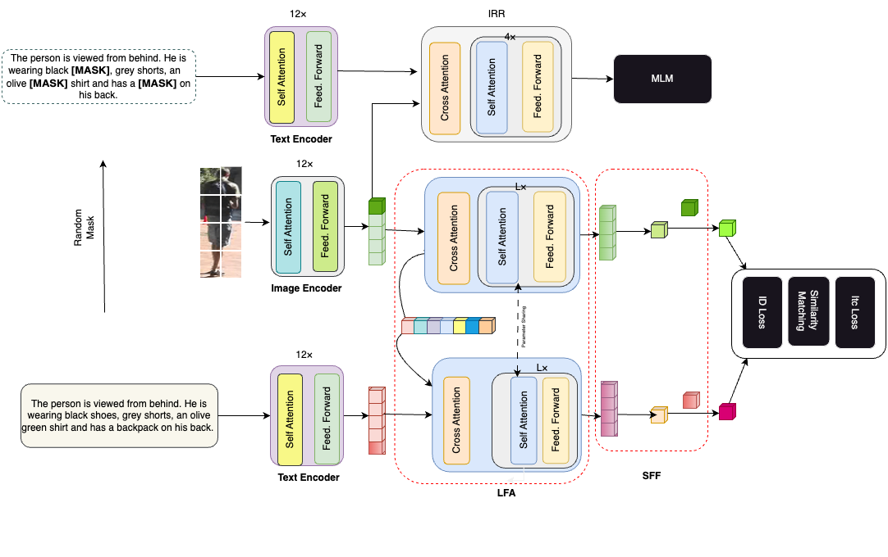
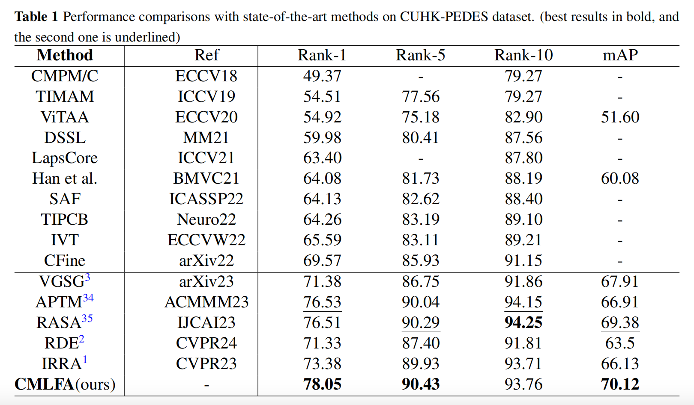
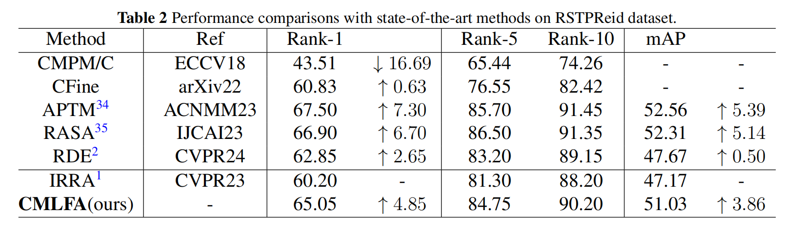

# CMLFA: Cross-Modal Latent Feature Aligning for Text-to-Image Person Re-identification

Official PyTorch implementation of the paper Cross-Modal Latent Feature Aligning for Text-to-Image Person Re-identification. 


## Highlights

  We propose a novel Cross-Modal Latent Feature Alignment (CMLFA) method, which uses learnable prototypes to capture shared features between image and text modalities and achieve aligned features. Specifically, CMLFA comprises four principal components: First, the CrossModal Encoder utilizes CLIP to project image and text features into a unified embedding space. Second, the Latent Feature Alignment (LFA) module employs learnable prototypes to extract and align features across image and text  modalities. Third, the Shared Feature Fusion (SFF) component integrates the aligned latent shared features with global  features to enhance generalization. Finally, the Joint Loss Function incorporates ID loss, ITC loss, and mask-based  unsupervised training to optimize feature alignment. Experimental results on CUHK-PEDES benchmarks demonstrate  CMLFA’s effectiveness, surpassing state-of-the-art methods with improvements in Rank-1 accuracy by 1.54%.





## Usage
### Requirements
we use single RTX3090Ti 24G GPU for training and evaluation. 
```
pytorch 1.9.0
torchvision 0.10.0
prettytable
easydict
```

### Prepare Datasets
Download the CUHK-PEDES dataset from [here](https://github.com/ShuangLI59/Person-Search-with-Natural-Language-Description), ICFG-PEDES dataset from [here](https://github.com/zifyloo/SSAN) and RSTPReid dataset form [here](https://github.com/NjtechCVLab/RSTPReid-Dataset)

Organize them in `your dataset root dir` folder as follows:
```
|-- your dataset root dir/
|   |-- <CUHK-PEDES>/
|       |-- imgs
|            |-- cam_a
|            |-- cam_b
|            |-- ...
|       |-- reid_raw.json
|
|   |-- <ICFG-PEDES>/
|       |-- imgs
|            |-- test
|            |-- train 
|       |-- ICFG_PEDES.json
|
|   |-- <RSTPReid>/
|       |-- imgs
|       |-- data_captions.json
```


## Training

```python
CUDA_VISIBLE_DEVICES=0 \
python train.py \
--name cmlfa \
--img_aug \
--batch_size 64 \
--MLM \
--loss_names 'sdm+mlm+id+itc' \
--dataset_name 'CUHK-PEDES' \
--root_dir 'your dataset root dir' \
--num_epoch 150 \
--id_loss_weight 0.5 \
--mlm_loss_weight 0.5
```

## Testing

```python
python test.py --config_file 'path/to/model_dir/configs.yaml'
```

## CMLFA on Text-to-Image Person Retrieval Results
#### CUHK-PEDES dataset




#### RSTPReid dataset



## Acknowledgments
Some components of this code implementation are adopted from [CLIP](https://github.com/openai/CLIP), [TextReID](https://github.com/BrandonHanx/TextReID) [TransReID](https://github.com/damo-cv/TransReID) and [IRRA](https://github.com/anosorae/IRRA.git). We sincerely appreciate for their contributions.


